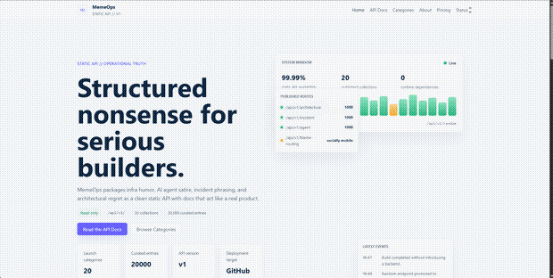

# MemeOps




MemeOps is a static JSON API and docs site for infra humor, AI agent satire, and postmortem-grade truth.

The project ships as a GitHub Pages-friendly static site under `docs/`, with source content stored in `content/` and generated API responses published to `docs/api/v1/`.

## Public Path

- Site: `https://tengfone.github.io/memeops/`
- API base: `https://tengfone.github.io/memeops/api/v1/`

## API Examples

Fetch the API catalog:

```bash
curl -s https://tengfone.github.io/memeops/api/v1/index.json
```

Fetch a random build-time sample:

```bash
curl -s https://tengfone.github.io/memeops/api/v1/random
```

Fetch a collection:

```bash
curl -s https://tengfone.github.io/memeops/api/v1/architecture
```

Pretty-print with `jq`:

```bash
curl -s https://tengfone.github.io/memeops/api/v1/random | jq
```

## What Ships In This Repo

- versioned JSON endpoints
- a static docs and explorer site
- curated content for twenty collections
- schema validation and index generation scripts
- fake SaaS surface area like pricing, status, and compliance

## Collections

- `architecture`
- `incident`
- `agent`
- `decision`
- `postmortem`
- `severity`
- `token`
- `startup`
- `observability`
- `deploy`
- `runbook`
- `latency`
- `oncall`
- `migration`
- `review`
- `compliance`
- `roadmap`
- `meeting`
- `ticket`
- `platform`

## Local Usage

```bash
npm run build
npm run preview
```

Open `http://localhost:4173/` after starting the preview server.

## Build Model

`content/` is the source of truth.

The build pipeline:

1. validates every content object
2. normalizes and publishes collection JSON files
3. generates category indexes and API metadata
4. writes JSON Schemas into `docs/schemas/`

No backend, auth, or write surface is involved.
